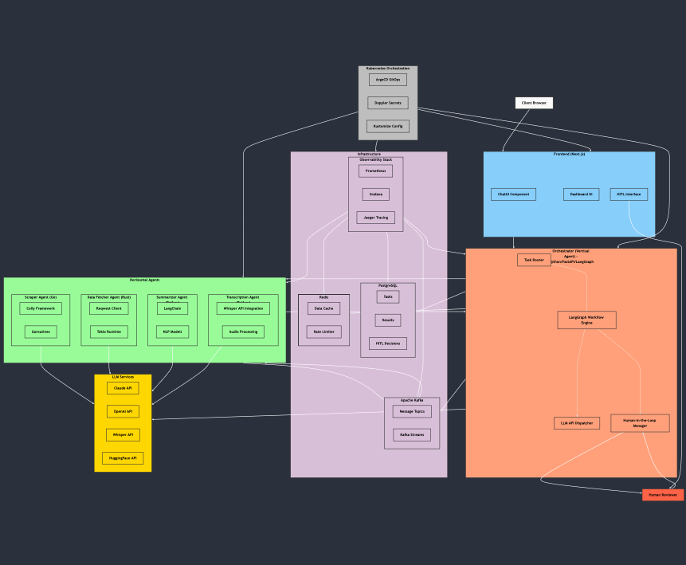

# Atheon AI Architecture

This document describes the architecture of the Atheon AI multi-agent orchestration system.

## Architecture Diagram

*Note: The architecture diagram will be created and placed in this directory.*

## System Components

### Orchestrator (Vertical Agent)

The orchestrator is the central component of the system, responsible for:

- Task routing and delegation to specialized agents
- State management and workflow coordination
- Human-in-the-loop integration
- Error handling and retry logic

**Technology Stack:**
- Python with FastAPI
- LangGraph for workflow orchestration
- Pydantic for data validation
- AsyncIO for non-blocking operations

### Specialized Agents (Horizontal Agents)

#### Scraper Agent

Responsible for web scraping tasks with high concurrency.

**Technology Stack:**
- Go language
- Colly framework for web scraping
- Concurrent processing with goroutines
- Rate limiting and respect for robots.txt

#### Data Fetcher Agent

Handles API data retrieval with efficient async processing.

**Technology Stack:**
- Rust language
- Tokio for async runtime
- Reqwest for HTTP requests
- Serde for serialization/deserialization

#### Summarizer Agent

Processes and summarizes text content using LLMs.

**Technology Stack:**
- Python
- LangChain for LLM integration
- Various LLM models (Claude, GPT-4, etc.)
- Text processing utilities

#### Transcription Agent

Converts audio to text with high accuracy.

**Technology Stack:**
- Python
- Whisper for speech-to-text
- Audio processing libraries
- Streaming capabilities

### Frontend

User interface for task management and results visualization.

**Technology Stack:**
- Next.js React framework
- TypeScript for type safety
- Tailwind CSS for styling
- Shadcn UI components
- React Query for data fetching

### Infrastructure Components

#### Message Broker

Handles asynchronous communication between services.

**Technology:**
- Apache Kafka
- Schema Registry for message validation

#### Database

Stores task data, results, and system state.

**Technology:**
- PostgreSQL
- Connection pooling with PgBouncer

#### Cache

Provides temporary storage and rate limiting.

**Technology:**
- Redis
- Key-value storage with expiration

#### Observability

Monitors system health and performance.

**Technology:**
- Prometheus for metrics
- Grafana for visualization
- Jaeger for distributed tracing
- Structured logging with correlation IDs

## Communication Flow

1. **Task Creation**: Tasks are created via the API or frontend
2. **Task Routing**: Orchestrator analyzes the task and routes it to appropriate agents
3. **Task Execution**: Agents process the task and return results
4. **Result Aggregation**: Orchestrator combines results from multiple agents if needed
5. **Human Validation**: Critical tasks are sent for human review
6. **Task Completion**: Results are stored and made available to the user

## Deployment Architecture

The system is deployed using a containerized approach with Kubernetes:

- Each component runs in its own container
- Kubernetes manages scaling, health checks, and resource allocation
- Kustomize handles environment-specific configurations
- ArgoCD provides GitOps-based continuous delivery
- Doppler manages secrets across environments

## Security Considerations

- Zero-trust network model with explicit network policies
- Non-root container execution
- Secret management with Doppler
- RBAC for Kubernetes resources
- Regular security scanning of container images 